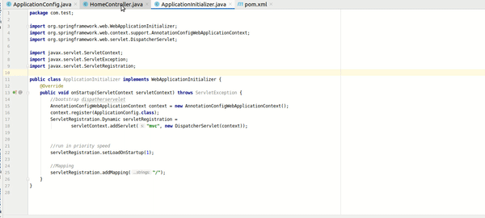

# java-maven-example-project
I am self learning jave spring web applications. In tthis point I am going to make a spring simple maven web applicarion with dependencies . We will see...

Mainly I have developed class-initializer, configuration of the view, /home Controller for my testing purposes,
The whole website is under-developing and I am used to learn the maven so I created this
the look of the web-site is like that which is smoothly loading than conventional web-site loading methodologies,

      <strong>
            The UI design is like that,
      </strong>
       
      
       
       
      <strong>
            The coading be like,
      </strong>
       
      

